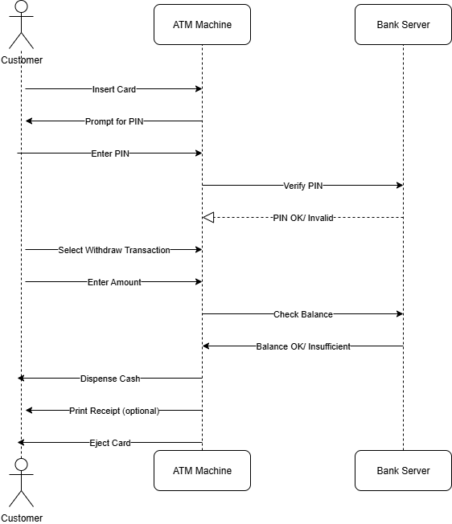
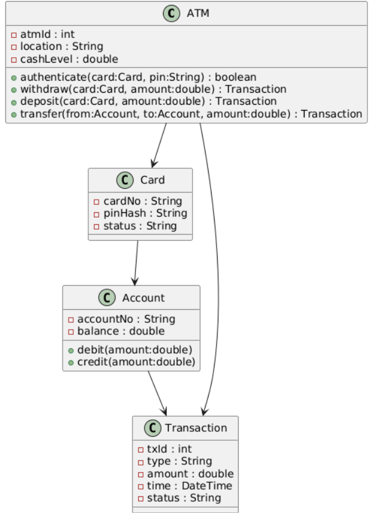
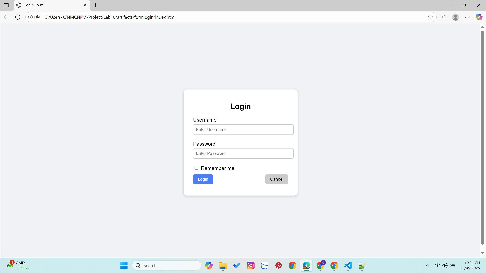
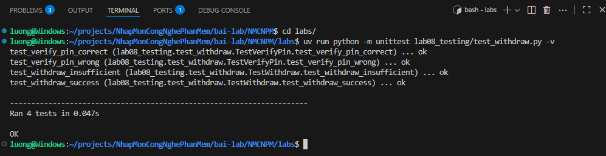
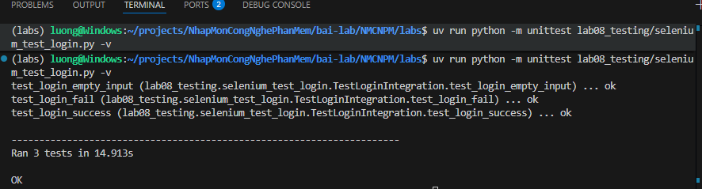
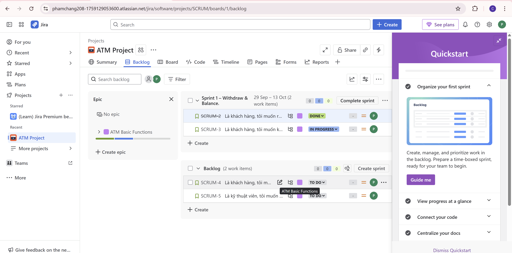
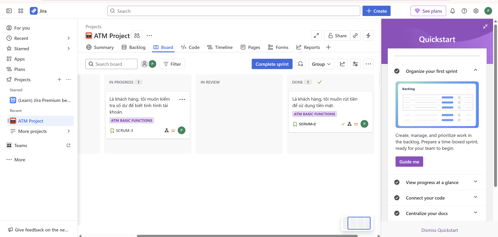
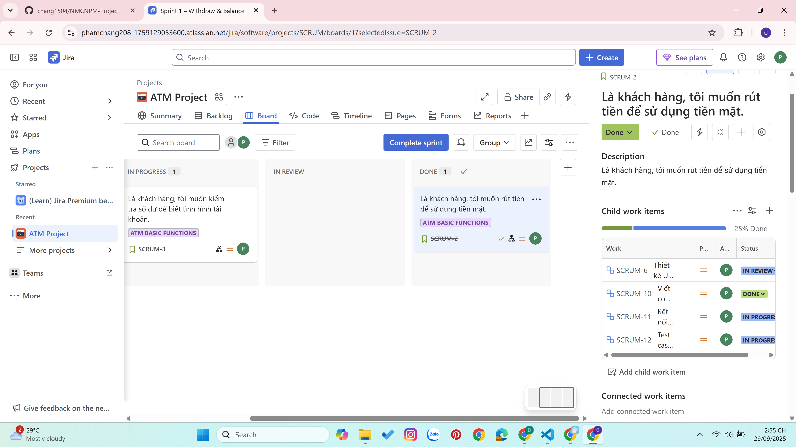
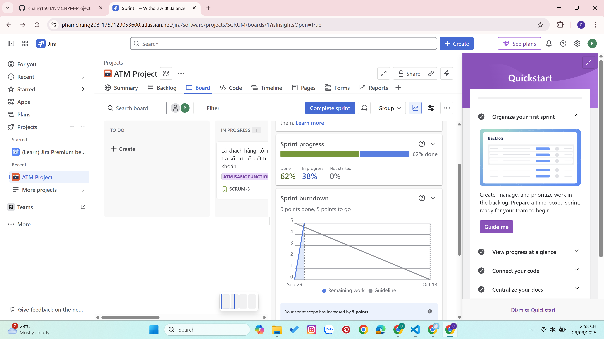

# ATM Mini-Project – Final Report

## 1. Giới thiệu
ATM Mini-Project là sản phẩm tổng hợp từ các lab trước, mục tiêu:
- Mô phỏng hệ thống rút tiền qua thẻ ATM.
- Tích hợp các thành phần UML, Database, Module, Test, và Quản lý dự án (Jira).
- Trình bày demo: Đăng nhập → Rút tiền → Kiểm thử.

---

## 2. UML Models

### 2.1 Use Case Diagram

### 2.2 Sequence Diagram

### 2.3 Class Diagram

---

## 3. Database Design

### 3.1 ERD

### 3.2 Database Schema

---

## 4. Giao diện & Module

### 4.1 Form Login

### 4.2 Withdraw Module

---

## 5. Testing

### 5.1 Unit Test (verify_pin, withdraw)
- Case: PIN đúng / PIN sai  
- Case: Đủ tiền / Không đủ tiền

### 5.2 Integration Test (Login Form với Selenium)
- Case: Login thành công  
- Case: Login sai  
- Case: Empty input  

**Kết quả test:**

---

## 6. Quản lý dự án với Jira
Sprint Planning, Task breakdown, Burndown chart.

### Jira Backlog

### Jira Board

### Jira Burndown

## 7. Demo cuối kỳ
- Chạy form login (Lab04).  
- Rút tiền từ DB (Lab07).  
- Kết hợp test (Lab08).  
- Trình bày Jira sprint (Lab09).  

**Hình demo:**

---

## 8. Kết luận & Định hướng mở rộng
- Hoàn thiện ATM mini-project với các module cơ bản.  
- Kết nối đầy đủ UML → Database → Module → Test → Quản lý.  
- Định hướng mở rộng:
  - Thêm chức năng chuyển khoản, in biên lai.
  - Tích hợp UI web/mobile.
  - Bảo mật nâng cao (hash + salt, OTP).

---

## 9. Tài liệu tham khảo
- Giáo trình môn NMCNPM.  
- MySQL Documentation.  
- PyTest, Selenium Docs.  
- Jira Atlassian Docs.  

---
